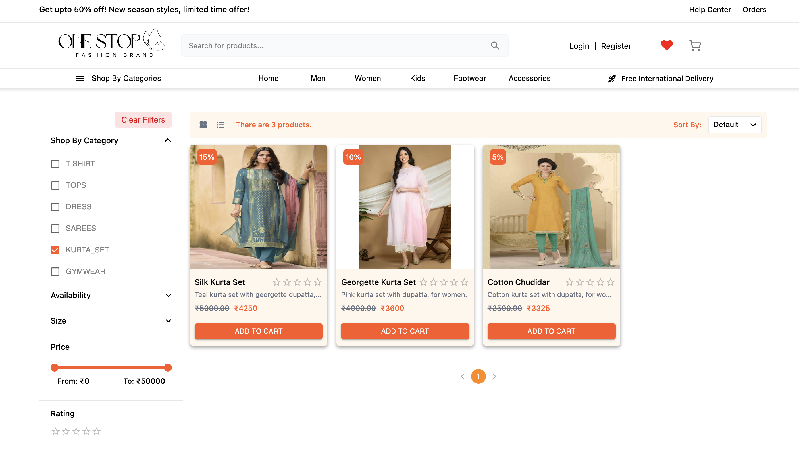
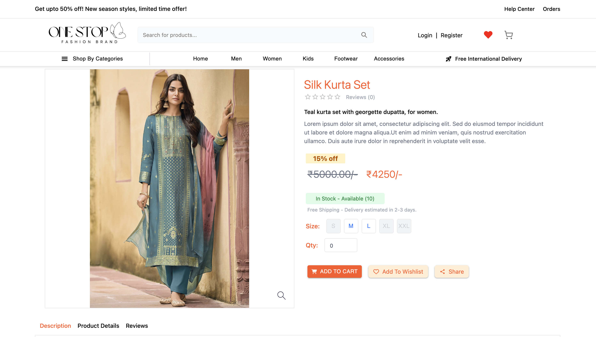
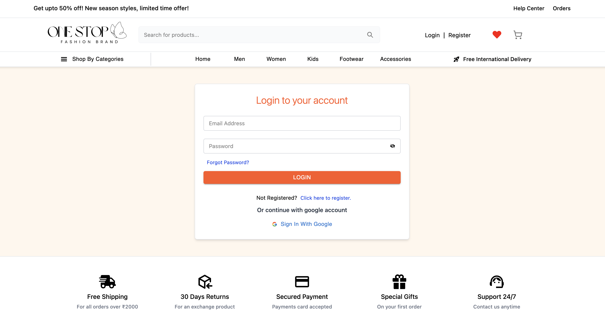
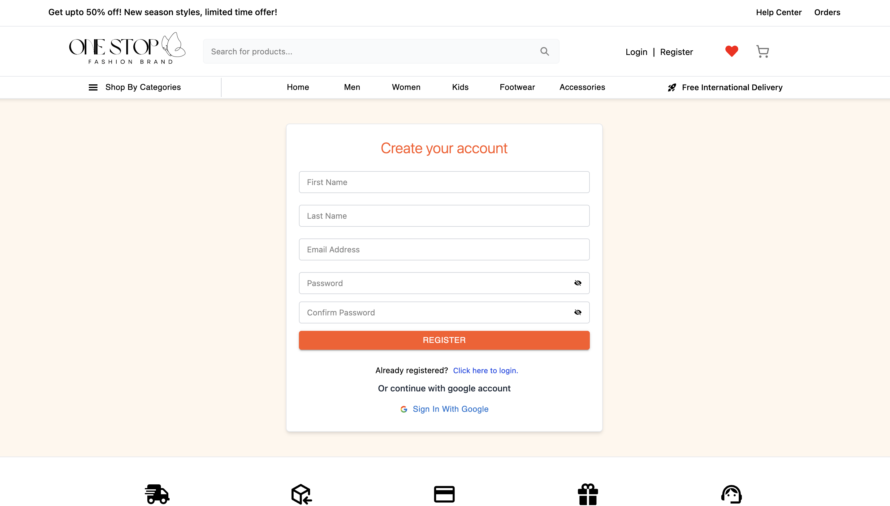
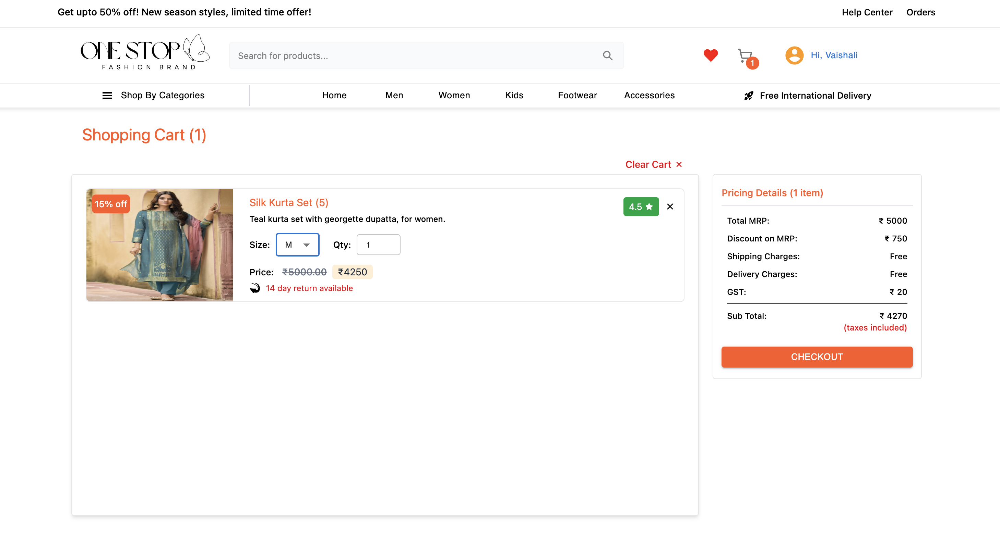
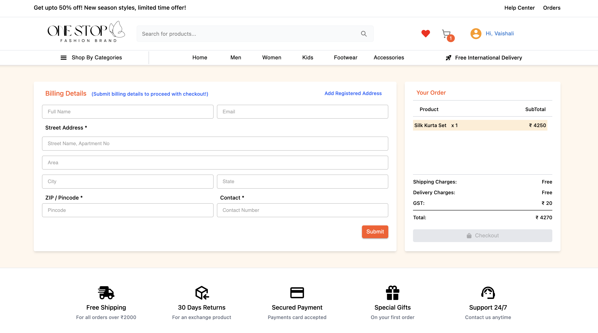
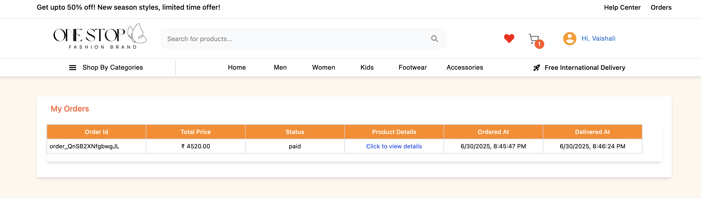

# 🛍️ One Stop E-Commerce

A full-stack **E-Commerce platform** built with **React**, **Node.js**, **Express**, **Knex.js**, and **PostgreSQL**.

---

## ⚙️ Tech Stack

| Layer    | Tech                                                           |
|----------|----------------------------------------------------------------|
| **Frontend** | React, Redux Toolkit, React Router DOM, Axios, Vite        |
| **Backend** | Node.js, Express, Knex.js                                   |
| **Database** | PostgreSQL                                                 |
| **Auth** | JWT (access + refresh)                                         |
| **State** | Redux slices for auth, cart, products, checkout  (Razorpay)   |
| **Styles** | CSS Modules, TailwindCSS, React Icons etc                    |

---

## 📌 Features

```
✅ **Modern Frontend** — React + Redux Toolkit + Vite  
✅ **Robust Backend** — Node.js + Express + Knex.js (SQL builder)  
✅ **Database** — PostgreSQL with migrations & seeds  
✅ **Auth** — JWT access & refresh tokens with secure cookie flow  
✅ **User Features** — Register, Login, Wishlist, Cart, Orders, Review and rating 
✅ **Product Management** — Categories, Subcategories, Variants, Stock 
✅ **Filters** — By category, price, size, rating, stock status with sorting and pagination
✅ **Error Handling** — Global error middleware + Redux error state  
✅ **Loading Skeletons** — Smooth UX during API calls  
✅ **Responsive** — Works on Desktop & Tablet
```

---

## 📌 Key Features in Detail

```
✅ Authentication
•	JWT-based login, register, logout.
•	Refresh token stored in HttpOnly cookie.
•	Secure token refresh flow.
•	Protected routes.

✅ Product Listing
•	Filter by category, subcategory, size, price, stock.
•	Pagination & sorting.
•	Wishlist support.

✅ Cart & Orders
•	Add/Remove items.
•	Place orders.
•	Clear cart on logout.

✅ Error Handling
•	Express global error middleware.
•	Frontend error boundary.
•	Redux error state for API failures.
```

## 🧩 Improvements & TODOs
```
•	✅ Add Google Sign-In / OAuth
•	✅ Add tests
```

Separate repository for backend - https://github.com/V-bhoy/ecommerce-backend

## 📸 Screenshots

### 🏠 Home Page


---

### 🛍️ Products


---

### Product Details


---

### Login


---

### Register


---

### 🛒 Cart Page


---

### 💳 Checkout


---

### Orders


---

```plaintext
Use case: 
This repository is shared publicly only to showcase my work and skills.

Restrictions: 
You may not copy, reuse, modify, or distribute any part of this project without my written permission.

If you wish to contribute or have any open issues, please contact me: vaishubhoyar004@gmail.com

© 2025 Vaishali Bhoyar. All rights reserved.
```


